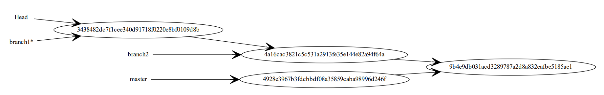

# wit

Python course exercise to code git like functionality

## Road map

[x] argv - implement basic program 'usage' statement.  
[x] 'init' command - create root folder for files tracking  

<blockquote>
    [x] track current working directory  
    [x] implement basic logger for console and file  
    [x] create .wit folder  
    [x] create 'images' and 'staging_area' folder inside .wit  
</blockquote>
[x] 'add' command - functionality to add files or folders to staging area  
[x] 'commit' command - functionality to create snapshot from staging area to images area  
[x] 'status' command - implement functionality to see files/folders status  
[ ] 'checkout' command - get snapshot from images back into working folder and staging area  
[ ] 'graph' command -  
[ ] 'branch' command -  
[ ] 'merge' command -  
